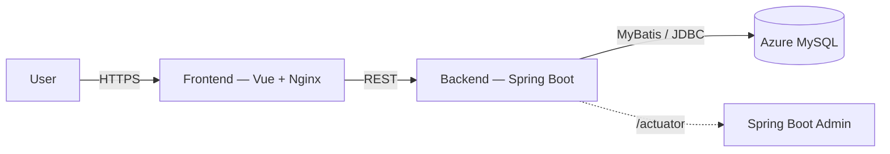
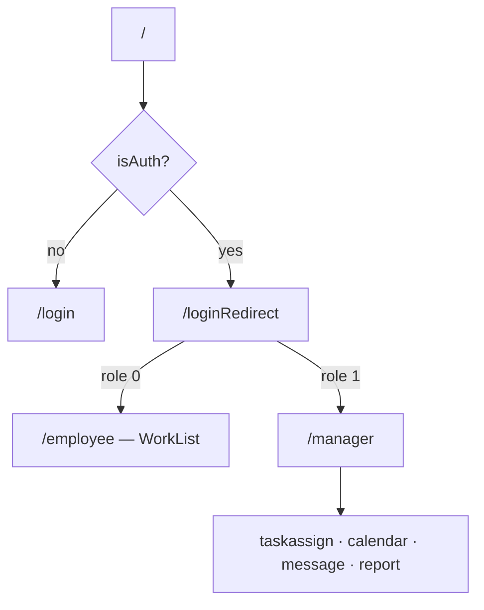

# MiniLab — 實驗室自動排程分配系統

MiniLab 將實驗室的可靠度測試需求分配給具備對應技能的人員與機台。組長可手動排程，也可依技能、
資源可用時段與期限產生排程建議；系統檢查能力與時段衝突，並提供行事曆、任務追蹤及異常回報。

本專案為陽明交通大學「雲原生軟體開發與最佳實踐」期末專題，題目取自台積電 IT 提出的產線情境。

- 開發文件：<https://hackmd.io/BB4n_xctTsus2xEmPvc1dQ?view>
- API 文件：<https://hackmd.io/@Eric7654321/rkEZGMq-gg>

## 功能

| 角色 | 能做的事 |
|---|---|
| 系統管理員 | 人員 / 機器 CRUD、定義並掛載技能 tag、對出狀況的人力物力掛「不可用」 |
| 組長 | 手動 / 自動排程、下達任務指令、追蹤組員狀態、收發意外回報 |
| 組員 | 看行事曆（今日 / 兩週內的任務）、回報任務完成或異常 |

排程規則：一個人可在同一時段借多台機器；一台機器同一時段只能被一人借用；任務所需技能必須落在
被指派人員與機器的 tag 內。人員 / 機器被排入任務後，任務結束前鎖定其 tag 修改。

## 架構



後端每個請求先過 JWT `LoginCheckInterceptor`，再進 `Controller → Service → Mapper(MyBatis XML) → MySQL`。

單體式：本場景日請求量約 1000，單體足以承載，模組邊界靠 interface 切開，要拆時再拆。
自動排程在後端：`schedule/AutoScheduler` 是一個不依賴 Spring 與資料庫的純類別。輸入一批只寫了
「要什麼技能、做多久、幾台機器、最早何時能開始、期限」的需求，輸出**誰做、用哪幾台、什麼時候做**。
時段由它自己找：只需試最早可開始時間與每段既有佔用的結束點，因為任何可行的擺放都能往前推到
撞上某個佔用的結尾為止，不必逐分鐘掃描。需求之間先排合格人選最少、期限最早的，
同樣有空時挑目前累積工時最少的人；排不進去的附上原因退回。
它只算不寫，組長在畫面上確認後才走 `/schedule/auto/ack` 檢查合法性並寫入。

## 技術棧

| 層 | 用了什麼 |
|---|---|
| 前端 | TypeScript、Vue、Nginx |
| 後端 | Java 17、Spring Boot、MyBatis、Maven、JWT、SLF4J |
| 資料庫 | Azure Database for MySQL |
| 可觀測性 | Actuator + Spring Boot Admin、Micrometer / Prometheus、tracing |
| 佈署 | Docker、Kubernetes、GitHub Actions |

## 專案結構

```
backend/MiniLab/src/main/java/com/minilab/
├── controller/   Login / Emp / Machine / Task / Schedule / Test
├── service/  service/impl/   業務邏輯
├── mapper/   MyBatis 介面（XML 在 resources/com/minilab/mapper/）
├── pojo/entity/   Emp / EmpTag / Machine / MachineTag / Task / Message / Result
├── pojo/vo/       EmpVO / MachineVO（對外，不含密碼）
├── interceptor/   LoginCheckInterceptor（JWT）
└── utils/         JwtUtils

frontend/                Vue + Dockerfile
k8s/                     deploys / services / ingress
.github/workflows/       ci.yaml（測試 + 格式化）、cd.yaml（build & push image）
docker-compose.yaml      本機啟動前後端
```

## 前端

Vue 3 SPA（Vite + TS、Pinia、axios、naive-ui）。JWT 存 cookie，`UserData`（Pinia）解碼後掛到 axios header；
`router.beforeEach` 依 `meta.requireAuth` / `meta.manager` 與 store 的 `role` 做守衛。



```
frontend/src/
├── views/        LoginView / Manager / taskAssignView / Calendar / Message / ReportViews / ChangePasswordView
├── components/    EmployeeCard·Form / MachineCard·Form / WorkList / HeaderBar / AddEmployee / AlertText
├── stores/       UserData（JWT + auth）、theme
└── router/       路由 + requireAuth / manager 守衛
```

指令：`npm run dev` / `npm run build` / `npm run lint` / `npm run format`。容器啟動時 `entrypoint.sh`
以環境變數代換 `default.conf.template` 產生 Nginx 設定（後端位址）。

## 資料模型

統一回傳 `Result { code(1 成功 / 0 失敗), msg, data }`。

| 表 | 欄位 |
|---|---|
| `emp` | id, username, name, password（加密）, usable, `group`, role(0 員工 / 1 組長 / 2 其他) |
| `emp_tag` | emp_id, tags（JSON 字串陣列，如 `["電性","物性"]`） |
| `machine` | id, name（顯示名）, machine_name（型號）, usable, `group` |
| `machine_tag` | machine_id, tags（JSON 字串陣列） |
| `task` | id, emp, machine（JSON 陣列）, start_time, end_time, tag（所需技能）, is_finish, updater_id |
| `message` | task_id, description, `group`, status |

對外的 `EmpVO` 只帶 `jwt` / `tags`，不含 `password`。

## API

所有端點回傳 `Result`。請求 / 回應範例見 [API 文件](https://hackmd.io/@Eric7654321/rkEZGMq-gg)。

| 群組 | 端點 |
|---|---|
| Login | `POST /login`、`GET /auth/verify` |
| Emp | `GET /emp/search/{groupId}`、`POST /emp/insert`、`PUT /emp/update`、`PUT /emp/tag/update`、`DELETE /emp/delete` |
| Machine | `GET /machine/search/{groupId}`、`POST /machine/insert`、`PUT /machine/update`、`PUT /machine/tag/update`、`DELETE /machine/delete` |
| Task | `GET /task/search/{groupId}`、`GET /task/check/weeks/{id}`、`GET /task/check/today/{id}`、`POST /task/msg/send`、`GET /task/msg/get/{groupId}` |
| Schedule | `POST /schedule/auto/plan`（一批需求 → 建議指派，不寫入）、`POST /schedule/auto/ack`（提交多筆任務、檢查合法性後寫入）、`PUT /schedule/task/update`、`DELETE /schedule/task/delete` |

## 本機執行

需求：Docker；單獨跑後端需 JDK 17 + Maven 3.9 與一個 MySQL。

```bash
docker compose up --build                    # 啟動前後端

cd backend/MiniLab                            # 或單獨跑後端
export DB_HOST=... DB_PORT=3306 DB_USER=... DB_PASS=...
./mvnw spring-boot:run
```

後端 `:8080`，Actuator 在 `/actuator/*`。

## 測試

`@SpringBootTest` 整合測試，涵蓋排程新增 / 修改 / 刪除全流程與時段重疊碰撞。

```bash
cd backend/MiniLab && ./mvnw clean test       # 含 JaCoCo 覆蓋率
```

## CI / CD

| Workflow | 觸發 | 動作 |
|---|---|---|
| `ci.yaml` | push 到非 `main` | `mvn clean test` → `mvn formatter:format` + 前端 Prettier，有差異自動 commit |
| `cd.yaml` | push 到 `main` | build 前後端 image → push 到 `ghcr.io/eric7654321/minilab_{backend,frontend}` |

K8s：前後端各 `Deployment` replicas=3 + `Service` + `Ingress`，image 指向 GHCR。
